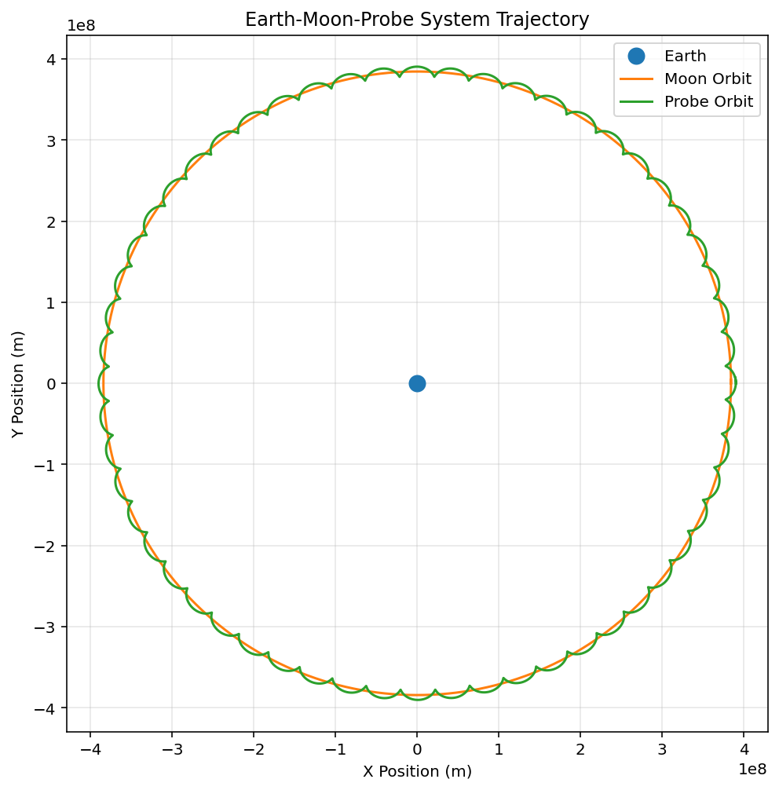

# 3-Body Earth-Moon-Probe Orbital Model

A numerical simulation of Earth-Moon-Probe gravitational trajectories using Python and SciPy initial value problem (`solve_ivp`) solvers.

## Features & System Overview
* **Restricted 3-Body System:** Models the coupled motion of a spacecraft in a lunar orbit using system ordinary differential equations (ODEs).
* **Numerical Precision:** Integrates equations of motion with strict relative (`1e-9`) and absolute (`1e-12`) tolerances.

## Results


## How to Run
```bash
# Clone repository
git clone [https://github.com/bobryanlow-dotcom/3body_orbital_model.git](https://github.com/bobryanlow-dotcom/3body_orbital_model.git)

# Run simulation
python main.py
